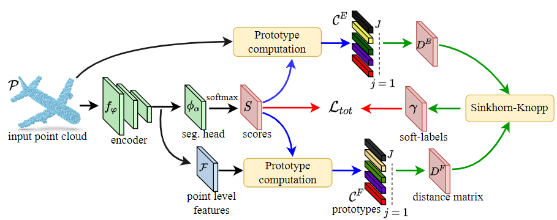

# SoftClu: Data Augmentation-free Unsupervised Learning for 3D Point Cloud Understanding (BMVC 2022 Oral)

Unsupervised learning on 3D point clouds has undergone a rapid evolution, especially thanks to data augmentation-based contrastive methods. However, data augmentation is not ideal as it requires a careful selection of the type of augmentations to perform, which in turn can affect the geometric and semantic information learned by the network during self-training. 
To overcome this issue, we propose an augmentation-free unsupervised approach for point clouds to learn transferable point-level features via soft clustering, named SoftClu. 
SoftClu assumes that the points belonging to a cluster should be close to each other in both geometric and feature spaces. This differs from typical contrastive learning, which builds similar representations for a whole point cloud and its augmented versions. 
We exploit the affiliation of points to their clusters as a proxy to enable self-training through a pseudo-label prediction task. 
Under the constraint that these pseudo-labels induce the equipartition of the point cloud, we cast SoftClu as an optimal transport problem, which can be solved by using an efficient variant of the Sinkhorn-Knopp algorithm. 
We formulate an unsupervised loss to minimize the standard cross-entropy between pseudo-labels and predicted labels. 
Experiments on downstream applications, such as 3D object classification, part segmentation, and semantic segmentation, show the effectiveness of our framework in outperforming state-of-the-art techniques.

<div align="center">
  
</div>

# This is a draft version.
## Citation
If you find this code useful for your work or use it in your project, please consider citing:
```bibtex
@inproceedings{mei2022data,
  title={Data Augmentation-free Unsupervised Learning for 3D Point Cloud Understanding},
  author={Mei, Guofeng and Saltori, Cristiano and Poiesi, Fabio and Zhang, Jian and Ricci, Elisa and Sebe, Nicu and Wu, Qiang},
  booktitle={2022 British Machine Vision Conference (BMVC)},
  month={November},
  year={2022},
}
```
